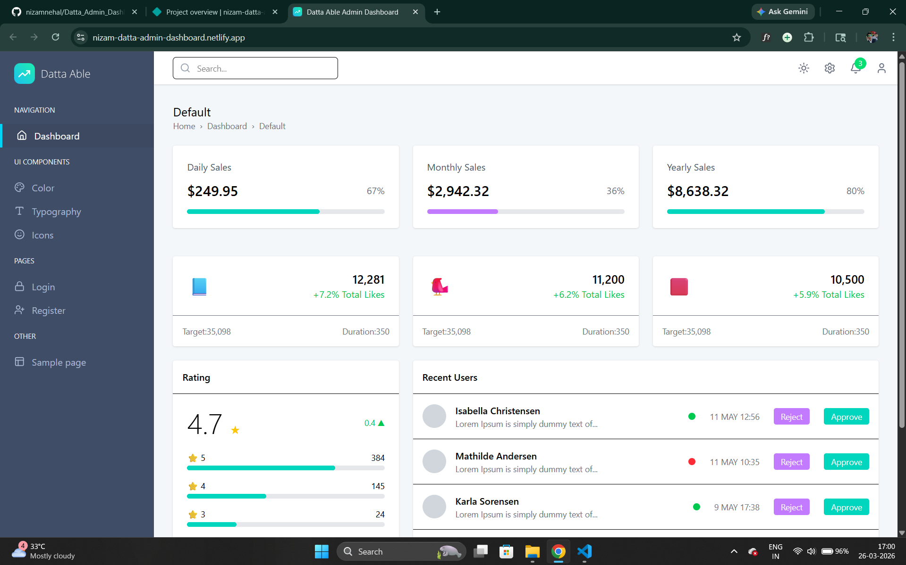

# 📊 Datta Admin Dashboard

<p align="center">
  <a href="https://nizam-datta-admin-dashboard.netlify.app">
    
  </a>
  <a href="https://github.com/nizamnehal/Datta_Admin_Dashboard">
    
  </a>
</p>

---

## 🚀 About The Project

A modern and fully responsive **Admin Dashboard** built using **React (Vite)**.
This dashboard provides a clean and scalable UI for managing data, visualizing analytics, and navigating different sections like authentication, dashboard metrics, UI components, and typography.

---

## 🌐 Live Demo

🚀 https://nizam-datta-admin-dashboard.netlify.app

---

## 📸 Preview

<p align="center">
  <a href="https://nizam-datta-admin-dashboard.netlify.app">
    
  </a>
</p>

---

## ✨ Features

* ✅ Modern React Dashboard UI
* ✅ Fully Responsive Layout
* ✅ Sidebar & Navbar Navigation
* ✅ Authentication Pages (Login / Register)
* ✅ Dashboard Analytics Cards
* ✅ Reusable Components
* ✅ Organized Folder Structure
* ✅ Clean & Scalable Code

---

## 🛠️ Tech Stack

<p>
  
</p>

* **React.js** — Frontend Library
* **Vite** — Fast Build Tool
* **JavaScript (ES6+)** — Logic & Functionality
* **CSS3** — Styling & Layout

---

## 📂 Project Structure

```
Datta_Admin_Dashboard/
│
├── dist/                         # Production build files
│   ├── assets/
│   │   ├── index-*.js
│   │   ├── index-*.css
│   │   ├── logo-dark.svg
│   │   ├── logo-white.svg
│   │   └── fav_icon.png
│   └── index.html
│
├── public/                       # Static public assets
│   ├── fav_icon.png
│   └── folder_structure
│
├── src/                          # Main source code
│
│   ├── assets/
│   │   ├── icons/
│   │   └── images/
│   │       ├── logo-dark.svg
│   │       ├── dashboard-preview.png
│   │       └── logo-white.svg
│
│   ├── components/
│   │   ├── common/
│   │   │   └── Breadcrumb.jsx
│   │   │
│   │   ├── layout/
│   │   │   ├── Footer.jsx
│   │   │   ├── MainLayout.jsx
│   │   │   ├── Navbar.jsx
│   │   │   └── Sidebar.jsx
│   │   │
│   │   └── ui/
│
│   ├── pages/
│   │   ├── auth/
│   │   │   ├── Login.jsx
│   │   │   └── Register.jsx
│   │   │
│   │   ├── color/
│   │   │   ├── Color.jsx
│   │   │   ├── ColorRow.jsx
│   │   │   └── ThemeColors.jsx
│   │   │
│   │   ├── dashboard/
│   │   │   ├── Dashboard.jsx
│   │   │   ├── RatingCard.jsx
│   │   │   ├── RecentUsers.jsx
│   │   │   ├── SalesCard.jsx
│   │   │   └── SocialCard.jsx
│   │   │
│   │   ├── icons/
│   │   │   └── Icons.jsx
│   │   │
│   │   ├── sample/
│   │   │   └── Sample.jsx
│   │   │
│   │   └── typography/
│   │       ├── Inline_Context.jsx
│   │       ├── ListsSection.jsx
│   │       ├── QuotesDescription.jsx
│   │       ├── Typography_Heading.jsx
│   │       └── Typography.jsx
│
│   ├── App.jsx
│   ├── App.css
│   ├── index.css
│   └── main.jsx
│
├── index.html
├── package.json
├── package-lock.json
├── vite.config.js
├── postcss.config.js
├── eslint.config.js
└── README.md
```

---

## 🎯 Purpose

This project was built to practice creating a **real-world admin dashboard** using React and Vite, focusing on component-based architecture, reusable UI, and scalable folder structure.

---

## 🚀 Getting Started

### Clone the repository

```
git clone https://github.com/nizamnehal/Datta_Admin_Dashboard.git
```

### Install dependencies

```
npm install
```

### Run the project

```
npm run dev
```

---

## 👨‍💻 Author

**Md Nizamuddin**

* GitHub: https://github.com/nizamnehal

---

## ⭐ Support

If you like this project, please ⭐ the repository!
